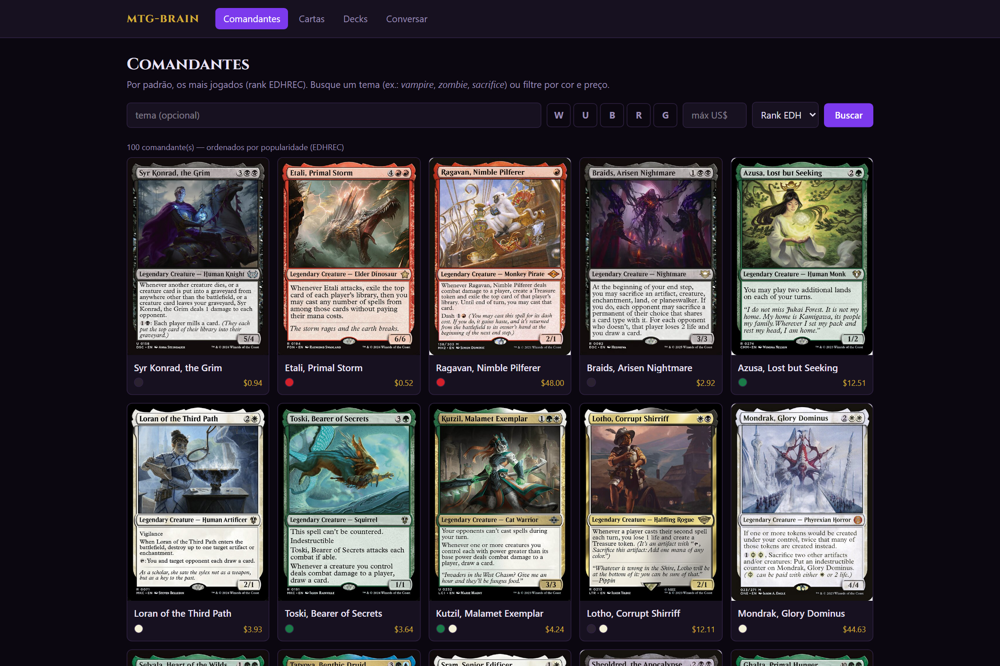
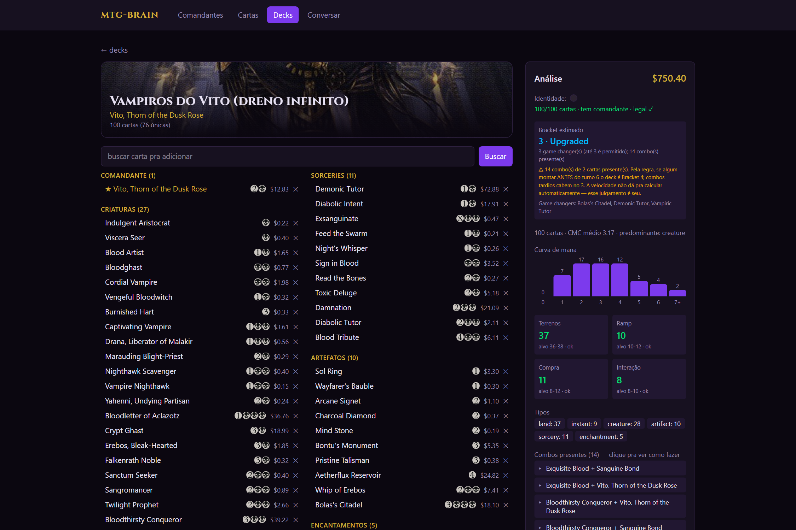
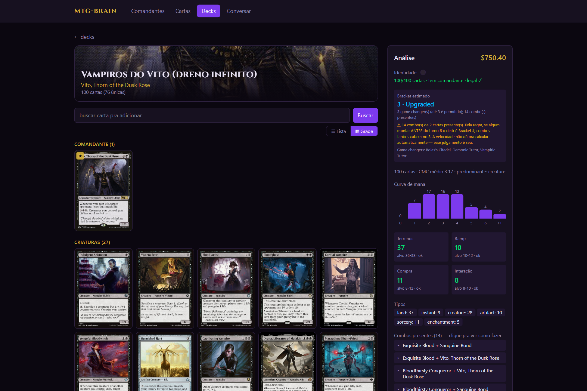
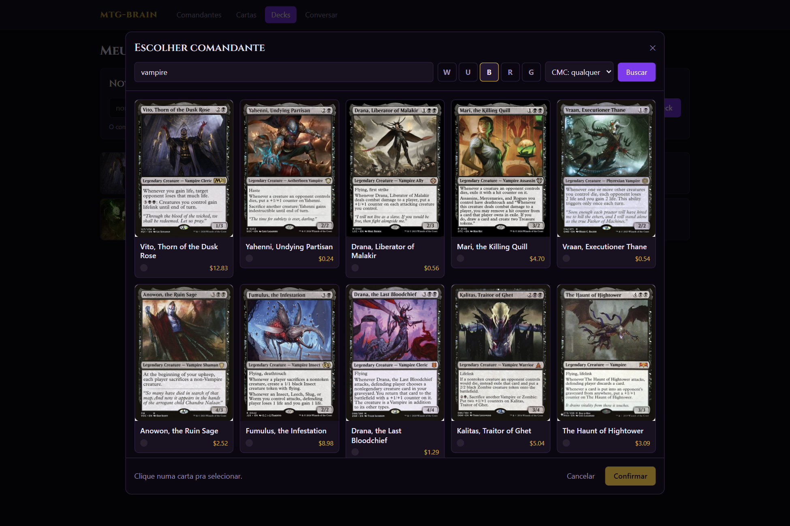
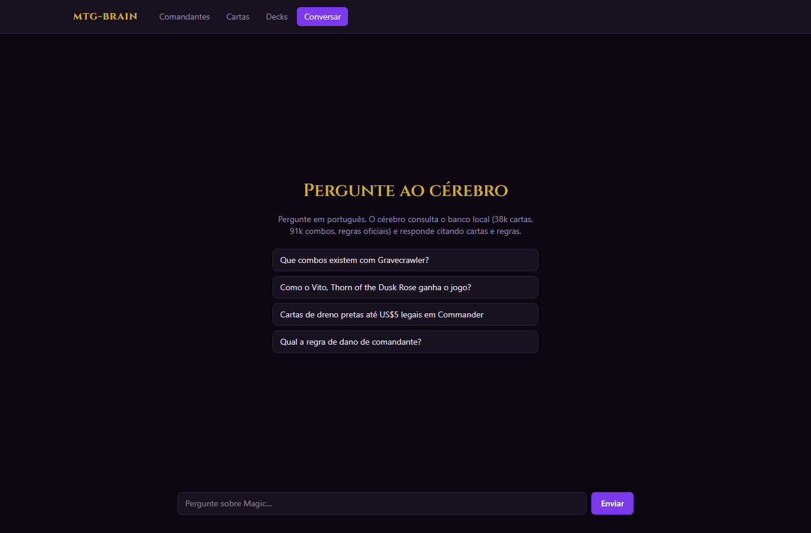

# mtg-brain

> Um “cérebro” local de **Magic: The Gathering** — banco de dados completo + API + app web + assistente de I.A. (RAG por *tool use*). Tudo rodando na sua máquina, a custo **US$ 0**.

O mtg-brain ingere praticamente *tudo* de Magic (cartas, preços, legalidades, regras oficiais, combos), guarda em Postgres e expõe isso de três formas: uma **API HTTP**, um **app web** com cara de site de Magic de verdade, e um **chat** em que um LLM responde perguntas consultando o banco em SQL somente-leitura.

| | |
|---|---|
| **Stack** | Python · FastAPI · PostgreSQL 17 · React + TypeScript · Vite · Tailwind · Ollama (LLM local) |
| **Fontes** | Scryfall · Commander Spellbook · Comprehensive Rules (WotC) |
| **Dados** | ~38 mil cartas · ~92 mil combos · regras oficiais · símbolos de mana oficiais |
| **Custo** | US$ 0 — Postgres em Docker e LLM local (Ollama) |

---

## O que dá pra fazer

- **Buscar comandantes** por tema (`vampire`, `sacrifice`, `mill`…), cor e preço, com a arte oficial das cartas.
- **Pesquisar qualquer carta** por nome ou texto de regras (`destroy target creature`, `loses life`…).
- **Montar decks** a partir de um **seletor de comandante** com filtros (cor, CMC, tema), com busca, sugestões por comandante, preview grande da carta no canto, e visualização em **lista** ou **grade de imagens** (estilo Moxfield/Archidekt).
- **Analisar o deck**: contagem por tipo, curva de mana, identidade de cor, ramp/compra/interação/terrenos, **bracket** (sistema oficial WotC) e **combos presentes**.
- **Exportar a decklist** em `.txt` (`<qtd> <nome>`, comandante no topo) — importável no Tabletop Simulator, Moxfield e Archidekt.
- **Conversar com o cérebro** em português: o LLM consulta o banco e responde citando cartas, combos e regras.

### Telas

| Comandantes | Deckbuilder + análise |
|---|---|
|  |  |

| Deck em grade | Seletor de comandante | Chat |
|---|---|---|
|  |  |  |

---

## Arquitetura

```
                         ┌──────────────────────────────────────────┐
  FONTES                 │                 INGESTÃO (ETL)            │
  Scryfall (bulk, API)   │  mtg_brain/ingest/  — idempotente,        │
  Commander Spellbook    │  resiliente a rate-limit, streaming ijson │
  Comprehensive Rules    └───────────────────────┬──────────────────┘
                                                  ▼
                                   ┌──────────────────────────────┐
                                   │   PostgreSQL 17 (Docker)      │
                                   │   cards · combos · rules ·    │
                                   │   rulings · sets · symbols ·  │
                                   │   decks · deck_cards          │
                                   │   view: commanders            │
                                   └───────┬───────────────┬───────┘
                                           ▼               ▼
        ┌────────────────────────────────────┐   ┌────────────────────────┐
        │  queries.py — SQL determinístico    │   │  brain.py — LLM/RAG     │
        │  (busca, análise, bracket, combos)  │   │  tool use: run_sql      │
        └───────────────┬─────────────────────┘   │  (SELECT-only, 15s)     │
                        ▼                          └───────────┬────────────┘
              ┌─────────────────────────────────────────────────────┐
              │  FastAPI (mtg_brain/api/app.py) — rotas /api/*       │
              │  serve também o build do React (mesma origem)        │
              └───────────────────────────┬─────────────────────────┘
                                          ▼
              ┌─────────────────────────────────────────────────────┐
              │  React + TS + Vite + Tailwind (web/)                 │
              │  Comandantes · Cartas · Decks · Conversar            │
              └─────────────────────────────────────────────────────┘
```

**Decisões de design**

- **`cards` guarda colunas normalizadas + o JSON Scryfall inteiro (`jsonb data`).** Nenhum atributo se perde; dá pra consultar qualquer campo depois sem reingerir.
- **RAG por *tool use*, não por embeddings.** O LLM ganha uma única ferramenta — rodar `SELECT` no Postgres — em vez de busca vetorial. Para dados estruturados (preço, cor, legalidade, combos), SQL é mais preciso e auditável. `pgvector` fica para busca semântica de texto de regra no futuro.
- **Guard-rails no SQL do LLM:** só `SELECT`/`WITH`, conexão `read_only`, `statement_timeout` de 15s. O modelo não consegue escrever no banco.
- **Tudo na mesma origem em produção:** a FastAPI serve o `web/dist`, com *fallback* de SPA — as rotas client-side (`/commanders`, `/decks`…) devolvem `index.html`.
- **Símbolos de mana oficiais:** baixados do endpoint `/symbology` do Scryfall (SVG oficial), não recriados à mão.

Detalhe completo da arquitetura em **[docs/ARCHITECTURE.md](docs/ARCHITECTURE.md)**.

---

## Setup

Pré-requisitos: **Docker**, **Python 3.12+** e (para o chat) **[Ollama](https://ollama.com)**.

```powershell
# 1. configuração
copy .env.example .env

# 2. sobe o Postgres
docker compose up -d

# 3. ambiente Python
python -m venv .venv
.\.venv\Scripts\Activate.ps1
pip install -r requirements.txt

# 4. cria as tabelas e ingere os dados (cards + combos baixam ~centenas de MB)
python -m mtg_brain init-db
python -m mtg_brain ingest all
python -m mtg_brain ingest prices symbols   # preços (default-cards) e símbolos oficiais

# 5. confere
python -m mtg_brain stats

# 6. frontend
cd web; npm install; npm run build; cd ..

# 7. sobe tudo (Postgres + API que serve o app) e abre o navegador
.\iniciar.ps1        # http://localhost:8000
```

> **Regras (Comprehensive Rules):** o `.txt` muda a cada coleção. Pegue o link atual em
> <https://magic.wizards.com/en/rules>, ponha em `CR_TXT_URL` no `.env` e rode
> `python -m mtg_brain ingest rules`.

### Chat local (opcional, US$ 0)

```powershell
ollama pull qwen2.5:14b     # ~9 GB; precisa de um modelo com tool calling
python -m mtg_brain ask "que combos existem com Gravecrawler?" -v
```

`-v` mostra as queries SQL que o modelo rodou. Backend/modelo se trocam no `.env`
(`LLM_BASE_URL`, `LLM_MODEL`, `LLM_API_KEY`) — serve também para Groq/Gemini grátis.

---

## CLI

| Comando | O que faz |
|---|---|
| `python -m mtg_brain init-db` | cria/atualiza o schema |
| `python -m mtg_brain ingest <alvos…>` | `sets`, `catalogs`, `cards`, `rulings`, `rules`, `combos`, `prices`, `symbols` ou `all` |
| `python -m mtg_brain stats` | conta registros por tabela |
| `python -m mtg_brain ask "<pergunta>" [-v]` | pergunta ao cérebro pela linha de comando |

A ingestão é **idempotente** (tudo é upsert) e **resumível** (combos retomam do offset em caso de rate-limit), então pode rodar de novo pra atualizar.

---

## API (resumo)

Tudo sob `/api`. Veja a doc interativa em `http://localhost:8000/docs` (Swagger, cortesia do FastAPI).

| Método e rota | Descrição |
|---|---|
| `GET /api/health` | status do banco e do LLM |
| `GET /api/stats` | contagem por tabela |
| `GET /api/symbols` | mapa `{ "{W}": svg_uri, … }` (símbolos oficiais) |
| `GET /api/cards?q=&colors=&limit=` | busca de cartas por nome/texto |
| `GET /api/cards/{id}` | detalhe da carta (+ rulings) |
| `GET /api/commanders` · `…/recommend` · `…/suggest` | lista / recomenda por tema / sugere cartas |
| `GET /api/combos?card=` · `?identity=` | combos por carta ou por identidade |
| `POST /api/chat` | pergunta ao cérebro `{ "question": "…" }` |
| `POST /api/decks` · `GET /api/decks` · `GET /api/decks/{id}` · `DELETE /api/decks/{id}` | CRUD de decks |
| `POST /api/decks/{id}/cards` · `DELETE …?name=` | adiciona / remove carta |
| `GET /api/decks/{id}/analysis` | análise completa do deck |

---

## Por que NÃO existe um “gerar deck” automático

Um protótipo de gerador **determinístico** foi construído e medido — e descartado de propósito. Ele montava 100 cartas legais, na identidade de cor, com manabase/cotas razoáveis, dentro de bracket e orçamento. Mas, avaliado com honestidade, ele escolhia por **popularidade (rank EDHREC)** e **nunca lia o texto do comandante**: não modelava o plano de jogo, não montava uma linha de combo coerente e não pontuava sinergia entre as cartas. Ou seja, entregava um *“goodstuff”* legal, não um deck **afinado**.

Construir um deck realmente bom exige **julgamento** — entender o motor do comandante, definir a vitória, escolher peças que conversam com o plano. Isso é trabalho de **I.A./LLM**, não de uma fórmula. Por isso a geração e a otimização de deck são deliberadamente delegadas ao **cérebro** (chat / Claude Code via MCP), e o app foca no que faz bem de forma **determinística e auditável**: dados, busca, construção manual e análise. O racional completo está em [docs/ARCHITECTURE.md](docs/ARCHITECTURE.md#geração-de-deck-decisão-de-arquitetura).

---

## Estrutura do projeto

```
mtg_brain/
  cli.py            # CLI (init-db / ingest / stats / ask)
  config.py db.py http.py
  brain.py          # LLM + RAG por tool use (run_sql somente-leitura)
  queries.py        # SQL determinístico: busca, análise, bracket
  ingest/           # scryfall.py · combos.py · rules.py
  api/app.py        # FastAPI + serve o frontend
db/                 # schema.sql · schema_deck.sql
web/                # React + TS + Vite + Tailwind
  src/pages/        # CommandersPage · CardsPage · DecksPage · ChatPage
  src/components/   # Mana (símbolos oficiais) · DeckAnalysis · CommanderCard …
docs/               # ARCHITECTURE.md · img/
```

---

## Roadmap

- **Fase 1 — Ingestão** ✅
- **Fase 2 — Banco consultável** ✅
- **Fase 3 — Cérebro (RAG via tool use)** ✅
- **Fase 4 — App web + deckbuilder + análise** ✅
- **Próximo:** geração/otimização de deck via LLM (chat/Claude Code); preços multi-fonte (USD/EUR/MTGO) + USD/BRL; busca semântica (pgvector); todas as impressões/artes com seletor de versão.

## Notas e atribuição

- Dados de cartas/preços via **Scryfall**; combos via **Commander Spellbook**; regras © **Wizards of the Coast**. Projeto pessoal, **não** afiliado nem endossado por nenhum deles.
- Preços vêm da impressão ingerida e são **aproximados**. Terrenos básicos são tratados como grátis.
- `data/`, `.env`, `web/dist` e `web/node_modules` ficam fora do git (veja `.gitignore`).
```
